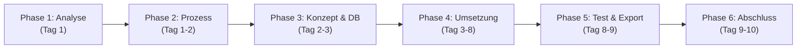
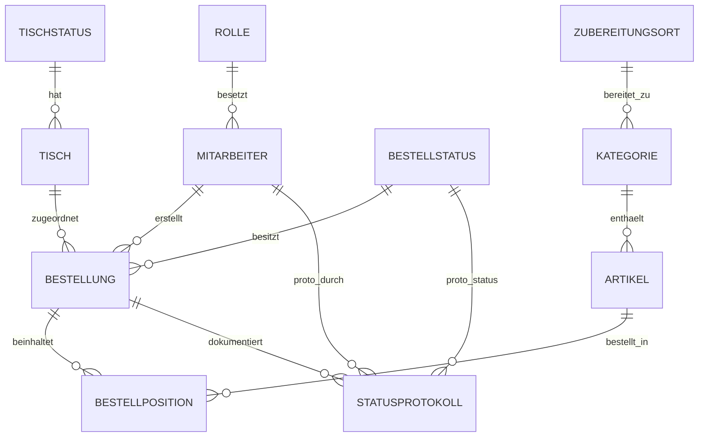

# Umfassender Projektbericht: Smart Restaurant

**Projektbezeichnung:** Digitales Bestell- und Verwaltungssystem für eine Gaststätte  
**Projekt-Repository:** `niki356565rt/LF10-Projekt`  
**Auftragnehmer (Szenario):** Another Great Solution GmbH (Team „Der Dreier“)  
**Auftraggeber (Szenario):** Regionales Gastronomieunternehmen  
**Projektlaufzeit:** 2 Wochen (10 Arbeitstage / 320 Personenstunden)  
**Dokumentenstand:** 24. September 2026  
**Status:** Vollständige Projektdokumentation & Konsolidierter Bericht  

---

## 1. Management Summary (Executive Summary)

Das Vorhaben **„Smart Restaurant“** befasst sich mit der Konzeption, Planung, Architektur, Datenbankmodellierung, physikalischen Datenbankerstellung in MariaDB/MySQL und Auditierung eines eigenen, digitalen Bestell- und Verwaltungssystems für einen mittelständischen Gastronomiebetrieb. Durch die Ablösung der bisherigen papierbasierten Bestellaufnahme wird der gesamte Betriebsablauf – von der Tisch- und Bestellaufnahme am Gästetisch über die Zubereitung in der Küche bzw. Bar bis hin zur Servierung, Rechnungsstellung und Abrechnung – durchgängig digitalisiert und transparent protokolliert.

Im Rahmen der Projektlaufzeit wurden sämtliche Fach- und IT-Grundlagen erarbeitet:
- **Anforderungs- & Prozessanalyse:** Definition von 26 strukturierten Muss- und Soll-Anforderungen (IDs `A-01`–`AD-10`) für die Funktionsbereiche Service, Küche und Administration.
- **Make-or-Buy-Entscheidung:** Qualifizierte Bewertung gegen Branchen-SaaS mit einer klaren Entscheidung für die **Eigenentwicklung (Make)** zur Sicherstellung der Erweiterbarkeit und Prozesskonformität.
- **Projektplanung & Agiles Vorgehen:** Strukturierung in 6 Phasen und 4 Sprints inkl. umfassender Risikomatrix (10 klassifizierte Projektrisiken).
- **Kosten- & Betriebskalkulation:** Vollständige Kostenrechnung über 320 Arbeitsstunden mit Herstellkosten von **14.900,00 €**, Selbstkosten von **17.880,00 €** und einem Angebotspreis von **19.668,00 € netto** (**23.404,92 € brutto**), ergänzt durch eine Zuordnung nach Einzel- und Gemeinkostenstellen.
- **Systemarchitektur, UML & 3NF-Datenbankmodell:** Detailliertes Soll-Architekturkonzept mit fachlichen Partitionen, verbindlichen UML-Diagrammen sowie einem relationalen **Datenbankschema in 3. Normalform (3NF)**.
- **Datenbankerzeugung & Export (.sql):** Physische Anlegung der Datenbank `smart_restaurant` in MariaDB, Befüllung mit realistischen Testdaten für alle 10 Tabellen und Export der vollständigen Datenbankstruktur inklusive Datensätze als standalone SQL-Dump-Datei ([`smart_restaurant_dump.sql`](file:///c:/Users/JohannesKirk/.cursor/plans/Projektarbeit/smart_restaurant_dump.sql) / [`docs/smart_restaurant_dump.sql`](file:///c:/Users/JohannesKirk/.cursor/plans/Projektarbeit/docs/smart_restaurant_dump.sql)).
- **Security, Compliance & ISO 27001:** Etablierung eines ISMS-Gesamtkonzepts nach ISO/IEC 27001:2022 (Annex A Mapping für 15 Kontrollen), DSGVO-Konformitätsprüfungen, Sicherheitsrichtlinien sowie ein vollständiges Audit-Framework mit 11 Prüfkriterien (`A-01`–`A-10`).

---

## 2. Projektgegenstand & Ausgangslage

### 2.1 Ausgangssituation & Problemstellung
In der Gaststätte werden Bestellungen traditionell manuell mit Papier und Stift aufgenommen. Dieser analoge Prozess führt in der Praxis zu prägnanten Engpässen:
- **Kommunikationsverluste & Handschriftenprobleme:** Lesefehler bei der Übermittlung von Sonderwünschen oder Artikeln an die Küche.
- **Verzögerungen:** Physische Wege des Servicepersonals zwischen Gästetisch und Küche bremsen den Gesamtablauf.
- **Fehlende Transparenz:** Kein Echtzeit-Überblick über offene, in Bearbeitung befindliche oder fertiggestellte Speisen und Getränke.
- **Manuelle Abrechnung:** Erhöhter Fehleraufwand bei der Rechnungsstellung und Rechnungsaufteilung.

### 2.2 Zielsetzung & Projektauftrag
Ziel des Projekts ist die Entwicklung einer maßgeschneiderten Softwarelösung, die den Bestellprozess digital optimiert. Das System adressiert drei Kernbereiche:
1. **Service:** Schnelle Bestellerfassung direkt am Tisch, Einsicht in Tischstatus, Servieren und Rechnungsabschluss.
2. **Küche / Bar:** Echtzeit-Anzeige eingehender Speisen (Küche) und Getränke (Bar) in chronologischer Reihenfolge mit Statusmeldung.
3. **Administration:** Stammdatenpflege für Mitarbeiter, Speise- und Getränkekarten (Artikel) sowie Raumplanung (Tische) inklusive kaufmännischer Auswertungen.

### 2.3 Projektorganisation & Team
Das Vorhaben wird von einer Projektgruppe aus vier Auszubildenden (Team „Der Dreier“ / Szenario-Auftragnehmer *Another Great Solution GmbH*) durchgeführt:

| Rolle | Hauptverantwortung |
|---|---|
| **Teamleitung & Organisation** | Projekt-Überblick, Terminüberwachung, Kanban-Steuerung, Projekttagebuch |
| **Analyse & Dokumentation** | Anforderungskatalog, Prozessmodellierung, Stakeholder-Analyse, Compliance |
| **Datenbank & Systemkern** | ER-Modellierung in 3NF, SQL-DDL-Erstellung, MariaDB-Erzeugung, Testdaten-Import & SQL-Export (`smart_restaurant_dump.sql`), Statusmaschine, Protokollierungslogik (A-13) |
| **Oberfläche & Frontend** | UI-Spezifikation für Service, Küche, Bar und Administration |

---

## 3. Anforderungsanalyse & Priorisierung

### 3.1 Beteiligte Benutzerrollen
Das System unterscheidet im Soll-Zustand zwischen drei primären Benutzerrollen (gemäß Anforderung `A-12`):
- **Service:** Tische auswählen, Bestellungen erfassen, Status auf `serviert` setzen, Rechnung anzeigen und Bezahlung abschließen (`bezahlt`).
- **Küche (und Bar):** Offene Bestellungen in zeitlicher Reihenfolge sehen, Status auf `in Bearbeitung` und `fertig` aktualisieren.
- **Administration:** Vollständige CRUD-Verwaltung von Mitarbeitern, Artikeln und Tischen sowie Einsicht in Auswertungen (z. B. Wochenumsatz).

### 3.2 Priorisierter Anforderungskatalog (Auszug)

Die Anforderungen wurden nach dem MoSCoW-Schema klassifiziert (Muss, Soll, Kann):

#### Allgemeine Anforderungen (Systemkern)
- **A-01 (Muss):** Eindeutige Tischnummern (keine Duplikate).
- **A-02 (Muss):** Tischkapazität zwischen 2 und 8 Personen.
- **A-03 (Muss):** Eindeutiger Tischstatus (`frei` vs. `besetzt`).
- **A-04 bis A-07 (Muss):** Zuordnung mehrerer Bestellungen pro Tisch, Zeitstempel, Bestellpositionen mit Artikel und Menge.
- **A-08 & A-09 (Muss):** Artikelstamm (Name, Preis, Kategorie) mit automatischer Weiterleitung an Küche (Speisen) bzw. Bar (Getränke).
- **A-10 (Muss):** Fünfstufiges Bestellstatus-Modell: `aufgegeben` → `in Bearbeitung` → `fertig` → `serviert` → `bezahlt`.
- **A-11 & A-12 (Muss):** Mitarbeiter-Stammdaten (Name, Benutzername, Rolle) für Service, Küche und Administration.
- **A-13 (Muss):** Lückenlose Audit-Protokollierung jeder Statusänderung mit Mitarbeiter-ID, Zeitstempel und Bestell-ID.

---

## 4. Strategische Entscheidungen (Make-or-Buy & Stakeholder)

### 4.1 Make-or-Buy-Entscheidung
**Entscheidung: Make (Eigenentwicklung)**  
*Begründung:* Der Projektauftrag verlangt explizit eine maßgeschneiderte Lösung. Die Eigenentwicklung garantiert volle Datenhoheit, individuelle Anpassbarkeit und die Vermeidung von herstellerbedingten Lizenzabhängigkeiten.

---

## 5. Projektplanung, Ressourcen & Risikomanagement

### 5.1 Phasen- & Sprints-Struktur (2-Wochen-Zeitraum)
Das Vorhaben ist auf genau **10 Arbeitstage** (2 Wochen) ausgelegt:



---

## 6. Kosten- & Wirtschaftlichkeitsbetrachtung

### 6.1 Gesamtkalkulation & Angebotspreis

$$Herstellkosten = Personalkosten (14.400,00\ €) + Sachkosten (500,00\ €) = 14.900,00\ €$$

$$Gemeinkosten = 20\% \times Herstellkosten = 2.980,00\ €$$

$$Selbstkosten = 14.900,00\ € + 2.980,00\ € = 17.880,00\ €$$

$$Gewinnzuschlag = 10\% \times Selbstkosten = 1.788,00\ €$$

- **Netto-Angebotspreis:** **19.668,00 €**
- **Umsatzsteuer (19 %):** **3.736,92 €**
- **Brutto-Angebotspreis:** **23.404,92 €**

---

## 7. Physikalische Datenbankerstellung, Testdaten & Export (.sql)

### 7.1 Relationales Datenbankschema in 3NF

Die Datenbank `smart_restaurant` wurde in MariaDB/MySQL angelegt. Sie basiert auf einem vollständig normalisierten Schema in 3. Normalform (3NF):



### 7.2 Datensätze & Testdaten-Befüllung

Die Datenbank wurde mit realitätsnahen Testdaten für den vollständigen Gastronomieablauf befüllt:
- **5 Mitarbeiter:** `Anna Service` (Service), `Ben Kellner` (Service), `Karl Koch` (Küche), `Maria Chefkoch` (Küche), `Chef Admin` (Admin).
- **8 Tische:** Kapazitäten zwischen 2 und 8 Personen mit Status `frei` und `belegt`.
- **6 Kategorien:** Vorspeisen, Hauptspeisen, Desserts (Küche) sowie Alkoholfreie Getränke, Heißgetränke, Bier & Wein (Bar).
- **15 Artikel:** Speisen & Getränke mit Preisgestaltung (z. B. Wiener Schnitzel 22,50 €, Pils 4,80 €).
- **4 Bestellungen & 13 Bestellpositionen:** Verschiedene Tischbestellungen in allen Phasen des Lebenszyklus (`aufgegeben`, `in Bearbeitung`, `serviert`, `bezahlt`).
- **12 Audit-Protokolle (A-13):** Lückenlose Historie aller Statuswechsel mit Mitarbeiter-ID und Zeitstempel.

### 7.3 Datenbank-Export (SQL-Dump)

Der physikalische Export aus MariaDB wurde mit `mysqldump` generiert und als wiederverwendbare SQL-Datei im Repository bereitgestellt:
- **Export-Datei:** [`smart_restaurant_dump.sql`](file:///c:/Users/JohannesKirk/.cursor/plans/Projektarbeit/smart_restaurant_dump.sql) (sowie [`docs/smart_restaurant_dump.sql`](file:///c:/Users/JohannesKirk/.cursor/plans/Projektarbeit/docs/smart_restaurant_dump.sql))
- **Inhalt:** `DROP DATABASE IF EXISTS`, `CREATE DATABASE`, `CREATE TABLE` (DDL mit PKs, FKs, Unique-Keys & Checks) sowie alle `INSERT INTO`-Datensätze (DML).

---

## 8. Security, Compliance & ISMS (ISO 27001 / DSGVO)

### 8.1 ISO/IEC 27001:2022 Mapping

| ISO 27001 Control | Bezeichnung | Umsetzung im Projekt | Status |
|---|---|---|---|
| **A.5.1** | Richtlinien für Informationssicherheit | Sicherheitsrichtlinien & ISMS-Konzept in `/internal-docs` abgelegt. | Erfüllt (Teilweise) |
| **A.5.2** | Rollen und Verantwortlichkeiten | RACI-Matrizen definiert; Fachrollen & SQL-Rollen-Tabelle (`rolle`) spezifiziert. | Erfüllt |
| **A.5.9** | Inventar der Informationen | Vollständige Dokumenten- und Dependency-Erfassung (`package-lock.json`). | Erfüllt |
| **A.5.10** | Akzeptable Nutzung von Werten | Ausschluss von Secrets/Echtdaten; `.gitignore` für Build-Caches und JARs. | Erfüllt |
| **A.8.15** | Protokollierung (Logging) | Protokollierung aller Statuswechsel in SQL-Tabelle `statusprotokoll` (A-13). | **Erfüllt & Befüllt** |

---

## 9. Qualitätssicherung & Audit-Framework

### 9.1 Verification & Record Counts
Nach dem Import der Datenbankstruktur und Testdaten wurden folgende Datensatzanzahlen in MariaDB/MySQL erfolgreich auditiert:

```sql
+-----------------+----------+
| Tabelle         | Datensätze |
+-----------------+----------+
| mitarbeiter     |        5 |
| tisch           |        8 |
| kategorie       |        6 |
| artikel         |       15 |
| bestellung      |        4 |
| bestellposition |       13 |
| statusprotokoll |       12 |
+-----------------+----------+
```

---

## 10. Projektergebnis, Fazit & Ausblick

Die physikalische Anlegung der Datenbank in MariaDB/MySQL, die Befüllung mit repräsentativen Testdaten sowie der Export der `.sql`-Dump-Datei wurden erfolgreich durchgeführt. Das Datenbankschema in 3. Normalform sowie der generierte SQL-Dump ([`smart_restaurant_dump.sql`](file:///c:/Users/JohannesKirk/.cursor/plans/Projektarbeit/smart_restaurant_dump.sql)) stehen abgabebereit im Repository zur Verfügung.

---
*Bericht erstellt und verifiziert durch das Entwicklungsteam „Der Dreier“ (Another Great Solution GmbH).*
