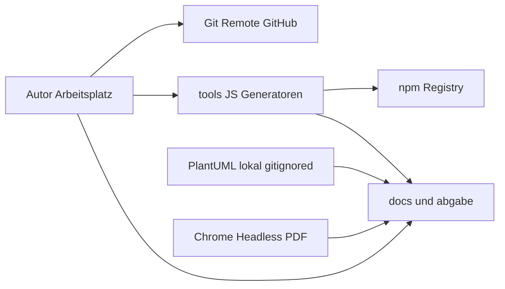

# Architektur-Übersicht

## Einleitung

Diese Übersicht beschreibt den Systemkontext des Repositories und die **geplante** Facharchitektur Smart Restaurant. Der Ist-Stand ist ein Dokumentations- und Generatorprojekt ohne Laufzeit-Backend. Die Soll-Architektur folgt dem Anforderungskatalog und dem Aktivitätsdiagramm des Bestellprozesses.

## Geltungsbereich

Gilt für Komponenten, Datenflüsse, Schnittstellen, Deployment-Annahmen und Trust Boundaries, soweit sie aus Dateien im Workspace ableitbar sind. Nicht im Geltungsbereich: konkrete Cloud-Regionen, Container-Orchestrierung und Datenbankprodukte – sie sind nicht gewählt.

## Begriffe und Definitionen

| Begriff | Definition |
|---|---|
| Partition | UML-Verantwortlichkeitsbereich Service, Systemkern, Küche und Bar. |
| Generator | Node- oder Java-Werkzeug, das Abgabe- oder Diagrammdateien erzeugt. |
| Fachkern | Geplante Persistenz und UI für Tisch, Bestellung, Artikel, Mitarbeiter. |

## Verantwortlichkeiten

| Tätigkeit | Projektleitung | Entwicklung | Auftraggeber | Compliance-Rolle |
|---|---|---|---|---|
| Architekturentscheidungen festhalten | A | R | C | C |
| UML an Katalog koppeln | A | R | C | I |
| Deployment festlegen | A | C | R | C |
| Trust Boundaries pflegen | A | R | I | C |

## Detailbeschreibung

### Systemkontext (Ist)

Akteure: Autoren/Studierende, Lehrende als Abnahmeinstanz. Externe Dienste: GitHub (Source-Hosting), npm (Paket `docx` und Transitive). Keine Gaststätten-Clients angebunden.

### Geplante Fachkomponenten (Soll)

| Komponente | Verantwortung | Quelle |
|---|---|---|
| Service-UI | Tisch, Bestellung, Servieren, Bezahlung entgegennehmen | S-01 bis S-08 |
| Küchen-UI | Offene Speisen, Status in Bearbeitung/fertig | K-01 bis K-05 |
| Bar-UI | Offene Getränkebestellungen empfangen; weitere Statusbearbeitung ist noch nicht im Sequenzdiagramm spezifiziert | A-09; UML 07 und UML 10 |
| Admin-UI | Mitarbeiter, Artikel, Tische, Auswertungen | AD-01 ff. |
| Systemkern | Speichern, Statusmaschine, Protokoll A-13 | UML 07 System-Partition |
| Persistenz | Tische, Bestellungen, Positionen, Logs | Katalog; Technologie offen |

### Datenflüsse Soll

Kontrollfluss Bestellung: Service legt eine Bestellung mit Speise- und/oder Getränkepositionen an → System setzt `aufgegeben` und schreibt Log → in zwei unabhängig bewachten `par`-Operanden werden Speisen an die Küchen-UI und Getränke an die Bar-UI gesendet; bei einer gemischten Bestellung laufen beide Operanden → Status `in Bearbeitung` / `fertig` mit Logs → Service serviert (`serviert`) → Rechnung/Bezahlung (`bezahlt`) → Tisch ggf. `frei`. Reine Getränke überspringen die Küche, reine Speisen die Bar. Die zeitliche Aufrufreihenfolge der Aufnahme steht in `docs/10-uml-sequenzdiagramm-bestellung-aufnehmen.drawio` (verbindliche Notation) und parallel in `docs/10-uml-sequenzdiagramm-bestellung-aufnehmen.puml`. `docs/11-uml-sequenzdiagramm-kueche-servieren-bezahlen.drawio` belegt nur den Küchenausschnitt (`inBearbeitung`, `fertig`, asynchrone `benachrichtigeFertig` an die Service-UI). Servieren, Rechnung, Bezahlung und Tischfreigabe sind in UML 11 nicht modelliert; sie bleiben im Aktivitätsdiagramm 07 und im Katalog nachzuweisen. UML 10 belegt die asynchronen Küchen-/Bar-Benachrichtigungen ohne Reply; die weitere Bar-Statusbearbeitung ist dort noch nicht spezifiziert.

Zusätzliches Lehrmodell: BubbleSort-Aktivitätsdiagramm (`docs/08-*`) beschreibt **keinen** Produktivpfad der Gaststätte, sondern den Kontrollfluss des Java-Snippets über `newList`. Weiteres Lehrmodell: `zoo.main` (`docs/09-*`) modelliert Erzeugung, Alias, Polymorphie und Methodenüberladung aus dem Java-Zoo-Beispiel (Partitions `zoo.main` / `Landtier` / `Tierarzt`).

### Schnittstellen

Ist: keine HTTP-API, keine DB-Connection-Strings. Soll: Service-, Küchen-, Bar- und Admin-UI zum Systemkern (lokal oder LAN); keine Gäste-App und kein Kartenlesegerät. Die Bar-UI ist durch die aktuelle Diagrammentscheidung Bestandteil der Soll-Modellierung, obwohl ältere Planungsdokumente sie noch als spätere Erweiterung führen; dieser Scope-Widerspruch ist vor Implementierungsbeginn zu entscheiden.

### Deployment-Modell

Ist: Arbeitsplatz mit Node, optional JDK 17, optional Chrome, Git. Soll: **klärungsbedürftig** (On-Premises Gaststätte vs. zentrales Hosting). Make-Entscheidung bedeutet Eigenbetrieb bzw. Betrieb durch das Entwicklungsteam, nicht SaaS-Branche.

### Integrationen

npm-Paket `docx` nur für Schulungsblätter. PlantUML nur Diagramm. Keine Zahlungs-, Lager- oder Identity-Integration im Umfang.

### Trust Boundaries

1. Öffentliches Git ↔ lokaler Workspace.
2. npm-Registry ↔ `node_modules` (Integrität über Lockfile-Hashes).
3. Geplant: Personal-Clients ↔ Anwendungskern ↔ Datenspeicher.
4. Geplant: Service-Netz vs. Küchenanzeige vs. Baranzeige vs. Admin (logische Rollentrennung, physische Trennung offen).

### Betriebsannahmen

- Keine Hochverfügbarkeit spezifiziert (2-Wochen-Kernprojekt).
- Protokoll A-13 ist fachlich, kein SIEM.
- BubbleSort-Diagramm ist Übungsartefakt.

### Architekturentscheidungen

| ID | Entscheidung | Status | Begründung |
|---|---|---|---|
| ADR-01 | Make statt Buy | getroffen | `docs/06-make-or-buy.md`, Auftrag |
| ADR-02 | Fachpartitionen Service, Küche, Bar | getroffen | UML 07 (`*.puml` und `*.drawio`). Abweichung zum Katalog: Abschnitt 8 / K-05 schließt eine eigene Bar-Ansicht aus; das Diagramm modelliert Getränke in der Partition Bar, Speisen weiter nur in Küche. |
| ADR-03 | Statusmodell fünf Werte plus Tisch frei/besetzt | getroffen | A-03, A-10 |
| ADR-04 | Persistenzprodukt | offen | nicht im Repo |
| ADR-05 | Auth-Provider | offen | nicht im Repo |
| ADR-06 | PlantUML lokal statt Online-Server | getroffen | JAR gitignored, Java 17 lokal |

## Nachweise und Artefakte

`docs/01-anforderungskatalog.md`, `docs/07-uml-aktivitaetsdiagramm-bestellprozess.puml`, `docs/07-uml-aktivitaetsdiagramm-bestellprozess.drawio`, `docs/08-uml-aktivitaetsdiagramm-bubblesort.puml`, `docs/09-uml-aktivitaetsdiagramm-zoo.puml`, `docs/09-uml-aktivitaetsdiagramm-zoo.drawio`, `docs/10-uml-sequenzdiagramm-bestellung-aufnehmen.drawio`, `docs/10-uml-sequenzdiagramm-bestellung-aufnehmen.puml`, `docs/11-uml-sequenzdiagramm-kueche-servieren-bezahlen.drawio`, `internal-docs/architektur/architektur.drawio`, `package.json`.

## Risiken und Kontrollen

| Risiko | Auswirkung | Eintrittswahrscheinlichkeit | Maßnahme | Kontrolle | Nachweis |
|---|---|---|---|---|---|
| Soll-Architektur als implementiert gelesen | Falsche Sicherheitslage | mittel | Ist/Soll trennen | Audit A-08 | dieses Dokument |
| Offene ADR-04/05 bis Go-Live | unsichere Default-Stacks | mittel | Eintrittskriterien in Sicherheitsrichtlinie | Review vor Code | `sicherheitsrichtlinien.md` |
| Zwei UML-Welten vermischt | Bestellprozess falsch | niedrig | Getrennte Dateinummer 07 vs. 08 | Dateinamen | `docs/` |
| Bar-UI in UML, aber in älterer Projektplanung ausgeschlossen | Unklarer Lieferumfang und nicht kalkulierter Rollen-/Client-Aufwand | mittel | Scope-Entscheidung vor Implementierungsbeginn; danach Katalog, Planung und Kalkulation gemeinsam nachziehen | Architektur- und Anforderungsreview | UML 10; `docs/02-projektplanung-bestellprozess.md`; `docs/04-kostenkalkulation.md` |

## Pflegeprozess

Bei Wahl von Framework, DB oder Hosting ADR-04/05 und das draw.io aktualisieren. Jede neue externe Schnittstelle erhält eine Trust Boundary.

## Revisionshistorie

| Datum | Autor/Rolle | Änderung | Anlass |
|---|---|---|---|
| 24.08.2026 | Entwicklung | Ist-Kontext Generator/Docs und Soll-Fachkern aus Katalog/UML | Aufbau `/internal-docs`; BubbleSort als Lehrmodell |
| 25.08.2026 | Entwicklung | Evidence-Pfad draw.io-UML 07; ADR-02 an Partition Bar angepasst | CHG-2026-08-25-02 |
| 26.08.2026 | Entwicklung | Lehrmodell zoo.main (`docs/09-*`) ergänzt | CHG-2026-08-26-01 |
| 27.08.2026 | Entwicklung | Sequenzdiagramme Bestellaufnahme und Küche/Service/Bezahlung (`docs/10-*`, `docs/11-*`) | CHG-2026-08-27-01 |
| 27.08.2026 | Entwicklung | Bar-UI und parallele Weiterleitung gemischter Bestellungen in UML 10 ergänzt; Scope-Widerspruch offengelegt | CHG-2026-08-27-07 |
| 27.08.2026 | Entwicklung | UML 11 auf Küchenstatus plus Service-Benachrichtigung begrenzt; Servieren/Bezahlen nicht mehr im Sequenzdiagramm | CHG-2026-08-27-09 |
| 27.08.2026 | Entwicklung | PlantUML-Fassung von UML 10 ergänzt | CHG-2026-08-27-10 |
